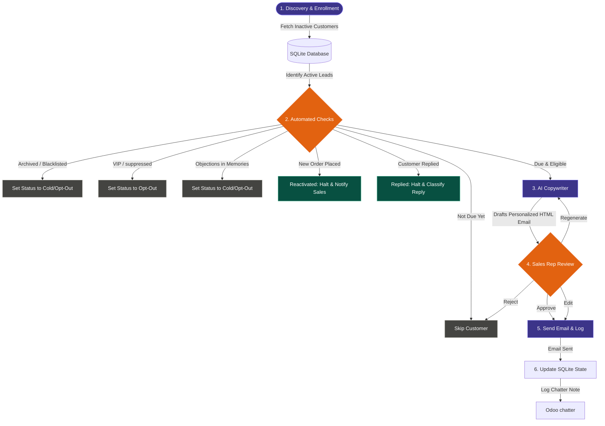

# Win-Back Sales Campaign Agent: High-Level Architecture

This document provides a simple, high-level overview of how the Win-Back Sales Campaign Agent works. It explains the flow from discovering inactive customers to sending emails and handling customer responses.

---

## High-Level Workflow Diagram

---

## Phase Explanations

### 1. Discovery & Enrollment
The system automatically queries Odoo once a day to find customers who haven't placed an order in **60+ days**. It saves these leads into the local SQLite database to start tracking their campaign.

### 2. Fast Constraint Checks
Before any heavy AI calculations occur, the system runs through a checklist:
* **Timing**: Is it time to send the next email? (Drips are spaced 7 days apart).
* **Odoo Status**: Is the customer still active and not blacklisted?
* **Suppression**: Is the customer tagged as a VIP, or in an active sales negotiation?
* **Reactivation**: Has the customer placed a new order since we last reached out? If yes, stop the campaign and alert the salesperson.
* **Replies**: Has the customer replied to us? If yes, stop the campaign and notify the salesperson.

### 3. AI Email Drafting (The Spoke)
If a customer passes all checks and is due for an email, the system wakes up the **AI Copywriter**. The AI looks at what product categories the customer previously bought to draft a highly personalized, low-pressure email signature and re-engagement copy.

### 4. Sales Representative Review (Human-in-the-Loop)
No emails are sent automatically. The system pauses and presents the email to the salesperson. The salesperson can:
* **Approve**: Send the email immediately.
* **Edit**: Adjust the subject or the body text manually.
* **Regenerate**: Ask the AI to write it again with a different tone.
* **Reject**: Skip this email entirely.

### 5. Send & Log (Odoo Integration)
* **Outreach**: The email is sent to the customer (via Gmail in test mode, or via Odoo in production).
* **Logging**: A record of the email is written to the customer's Odoo chatter history so the salesperson can see the full communications timeline.
* **Scheduler**: The next check is scheduled for 7 days in the future.
